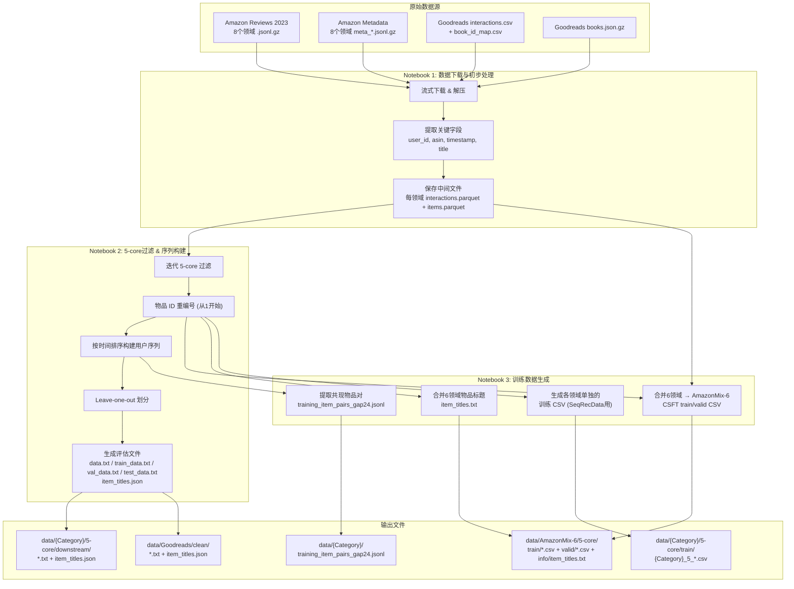

## 产品概述

从 Amazon Reviews 2023 原始数据和 Goodreads 原始数据出发，完整复现 LLM2Rec 论文所需的全部数据预处理流程。以 Jupyter Notebook 的形式实现，方便逐步查看和理解每一步数据变换。

## 核心功能

### 1. 原始数据下载

- 从 Amazon Reviews 2023 官方源下载 8 个领域的评论数据和元数据（6 个训练领域 + 2 个 OOD 评估领域）
- 从 UCSD Goodreads 数据集下载书籍元数据和用户交互数据

### 2. 5-core 过滤

- 对每个领域执行迭代式 5-core 过滤：反复移除交互次数少于 5 的用户和物品，直到收敛
- 过滤后统计各数据集的用户数、物品数、交互数，与论文 Table 1/2 对照验证

### 3. 序列构建与数据划分

- 按时间戳排序构建每个用户的交互序列，限制最大长度为 10
- 采用 leave-one-out 策略划分 train/val/test
- 物品 ID 从 1 开始重新编号

### 4. 生成下游评估文件（7 个数据集）

- `data.txt` / `train_data.txt` / `val_data.txt` / `test_data.txt`：纯文本，空格分隔的物品 ID 序列
- `item_titles.json`：物品 ID 到标题的映射（JSON 字典，key 从 "1" 开始）

### 5. 生成 CSFT 训练文件（AmazonMix-6 混合数据集）

- 合并 6 个 Amazon 领域的训练数据，生成 CSV 文件（含 `history_item_title`, `history_item_id`, `item_title`, `item_id` 列）
- 同时生成验证集 CSV

### 6. 生成 IEM 训练辅助文件

- `item_titles.txt`：合并 6 个领域的所有物品标题（纯文本，每行一个）
- `training_item_pairs_gap24.jsonl`：从用户序列中提取间隔不超过 24 的共现物品标题对

### 7. 数据验证与可视化

- 与论文 Table 1/2 的统计数据对比验证
- 可视化各数据集的交互分布、序列长度分布等

## 技术栈

- **语言**: Python 3.x
- **环境**: Jupyter Notebook (.ipynb)
- **核心依赖**:
- `pandas` - 数据处理和 CSV 操作
- `numpy` - 数值计算
- `requests` / `urllib` - 数据下载
- `gzip` / `json` - 压缩文件和 JSON 解析
- `matplotlib` / `seaborn` - 数据可视化
- `tqdm` - 进度条
- `collections` - Counter, defaultdict 等

## 实现方案

### 整体策略

将整个数据预处理流程拆分为 3 个有序的 Notebook，每个 Notebook 聚焦一个阶段，逐步引导用户理解数据格式、处理逻辑和最终输出。

### 关键技术决策

**1. 数据下载策略 — 流式下载 + 增量处理**

- Amazon Reviews 2023 原始数据非常大（如 Home_and_Kitchen 有 67.4M 评论），不能一次性全部加载到内存
- 采用 JSONL 流式逐行读取 `.jsonl.gz` 文件，只提取需要的字段（user_id, parent_asin, timestamp），边读边过滤
- 元数据文件同样流式处理，只提取 parent_asin 和 title

**2. 5-core 过滤 — 迭代式过滤直到收敛**

- 论文采用标准的 5-core filtering：反复移除交互次数 < 5 的用户和物品
- 实现为 while 循环，每轮计算用户/物品频次，移除不满足条件的记录，直到没有记录被移除
- 对于超大数据集（如 Electronics 4390万条），使用 pandas groupby + transform 做高效过滤

**3. 物品 ID 重编号 — 从 1 开始连续编号**

- 原始 ASIN 是字符串，需映射为从 1 开始的连续整数
- 代码中有 `assert "0" not in item_info` 和 `assert 0 not in item_ids`，ID 0 保留作为 padding
- 构建 asin → new_id 的映射字典，并在所有输出文件中统一使用

**4. CSV 文件中的列表字段格式**

- `history_item_title` 和 `history_item_id` 列存储的是 Python list 的字符串表示形式（如 `"['title1', 'title2']"`）
- 代码中用 `eval()` 解析这些字段，因此必须确保输出格式严格遵循 Python list 的 repr 形式

**5. training_item_pairs 的生成逻辑**

- 文件名含 `gap24`，表示在用户序列中，两个物品的位置间隔不超过 24
- 对每个用户序列，枚举所有满足距离约束的 (item_i, item_j) 对，提取其标题组成 pair
- 输出为 JSON 数组（虽然后缀 .jsonl），用 `json.loads(f.read().strip())` 一次性加载

**6. Goodreads 数据集的特殊处理**

- Goodreads 作为 OOD（域外）评估数据集，不参与训练，仅需生成评估文件
- 交互数据为 CSV 格式（`goodreads_interactions.csv`），需配合 `book_id_map.csv` 做 ID 映射
- 书籍标题从 `goodreads_books.json.gz` 中提取
- 论文最终结果：4,550 items, 158,347 interactions，需通过同样的 5-core 过滤达到

## 实现注意事项

**内存与性能**

- Home_and_Kitchen 和 Electronics 等大数据集原始评论数千万条，流式读取 `.jsonl.gz` 避免 OOM
- 5-core 过滤过程中使用 set 操作加速用户/物品频次过滤，避免重复构建 DataFrame
- Goodreads 的 `goodreads_interactions.csv` 约 4.1GB，使用 chunked reading

**数据正确性保障**

- 每个阶段输出后打印统计信息，与论文 Table 1/2 对照
- 论文统计：Games 9517 items / 153221 interactions, Arts 12454 / 132566, Movies 13190 / 136471, Home 33478 / 256001, Electronics 20150 / 197984, Tools 19964 / 159969, Goodreads 4550 / 158347
- 验证 leave-one-out 后训练集 + 验证集 + 测试集的交互总数是否一致

**文件路径兼容性**

- 确保所有生成的文件路径与代码中的硬编码路径完全匹配
- CSFT 的 CSV 文件名需匹配 shell 脚本中的 `${category}*.csv` 通配模式

## 架构设计

整个预处理流程的数据流如下：



## 目录结构

```
c:\Users\simonkchen\Downloads\LLM2Rec\
├── notebooks/
│   ├── 01_download_raw_data.ipynb       # [NEW] 数据下载与初步处理。负责从 Amazon Reviews 2023 和 Goodreads 官方源下载原始数据文件，流式解析 .jsonl.gz 文件并提取关键字段（user_id, parent_asin, timestamp 以及 title），保存为高效的 parquet 中间文件。包含下载进度展示、数据格式探索和初步统计。
│   ├── 02_filter_and_split.ipynb        # [NEW] 5-core过滤、序列构建与数据划分。对8个Amazon领域 + Goodreads 执行迭代式5-core过滤，物品ID从1开始重编号，按时间戳排序构建用户交互序列（最大长度10），采用leave-one-out策略划分train/val/test，生成所有评估所需文件（data.txt, train_data.txt, val_data.txt, test_data.txt, item_titles.json），输出统计信息与论文Table 1/2对照验证。
│   └── 03_generate_training_data.ipynb  # [NEW] 训练数据生成。合并6个Amazon领域的训练数据生成AmazonMix-6的CSFT CSV文件（train+valid），合并所有物品标题生成item_titles.txt（MNTP/SimCSE用），从用户序列中提取间隔不超过24的共现物品对生成training_item_pairs_gap24.jsonl（IEM RecItemData用），生成各领域单独的训练CSV文件（IEM SeqRecData用）。包含最终数据验证和完整性检查。
├── data/                                # [NEW] 所有生成的数据文件的输出目录
│   ├── raw/                             # [NEW] 下载的原始数据缓存目录
│   ├── intermediate/                    # [NEW] 中间处理结果（parquet文件）
│   ├── Video_Games/
│   │   ├── 5-core/
│   │   │   ├── downstream/              # [NEW] 评估文件
│   │   │   │   ├── data.txt
│   │   │   │   ├── train_data.txt
│   │   │   │   ├── val_data.txt
│   │   │   │   ├── test_data.txt
│   │   │   │   └── item_titles.json
│   │   │   └── train/                   # [NEW] 领域训练CSV
│   │   │       └── Video_Games_5_*.csv
│   │   └── training_item_pairs_gap24.jsonl  # [NEW] 物品对数据
│   ├── Arts_Crafts_and_Sewing/          # [NEW] 同上结构
│   ├── Movies_and_TV/                   # [NEW] 同上结构
│   ├── Home_and_Kitchen/                # [NEW] 同上结构
│   ├── Electronics/                     # [NEW] 同上结构
│   ├── Tools_and_Home_Improvement/      # [NEW] 同上结构
│   ├── Sports_and_Outdoors/             # [NEW] 仅评估文件（OOD）
│   │   └── 5-core/downstream/
│   ├── Baby_Products/                   # [NEW] 仅评估文件（OOD）
│   │   └── 5-core/downstream/
│   ├── Goodreads/                       # [NEW] 仅评估文件（OOD）
│   │   └── clean/
│   └── AmazonMix-6/                     # [NEW] 混合训练数据
│       └── 5-core/
│           ├── train/
│           │   └── AmazonMix-6_5_mixed.csv
│           ├── valid/
│           │   └── AmazonMix-6_5_mixed.csv
│           └── info/
│               └── item_titles.txt
└── requirements_data.txt                # [NEW] 数据预处理所需的Python依赖列表
```

## 关键数据结构

```python
# item_titles.json 格式（key从"1"开始，不含"0"）
{
    "1": "Logitech G13 Programmable Gameboard",
    "2": "Tamron AF 70-300mm Camera Lens",
    ...
}

# CSFT训练CSV格式
# history_item_title 和 history_item_id 为 Python list 的 str(repr) 形式
# | history_item_title                      | history_item_id | item_title           | item_id |
# | "['Logitech G13', 'Tamron Lens']"       | "[1, 2]"        | "AirPods Pro"        | 42      |

# data.txt / train_data.txt 格式（每行一个用户序列，空格分隔的整数ID）
# 12 45 78 102 3
# 7 89 234 56

# training_item_pairs_gap24.jsonl 格式（整体为JSON数组）
# [["Item Title A", "Item Title B"], ["Item Title C", "Item Title D"], ...]

# item_titles.txt 格式（每行一个标题）
# Logitech G13 Programmable Gameboard
# Tamron AF 70-300mm Camera Lens
```

## Agent Extensions

### SubAgent

- **code-explorer**
- Purpose: 在实现过程中快速搜索代码仓库中的数据格式要求和路径约束，确保生成的数据文件完全兼容现有代码
- Expected outcome: 准确定位所有数据加载代码中的格式要求、路径映射和断言条件