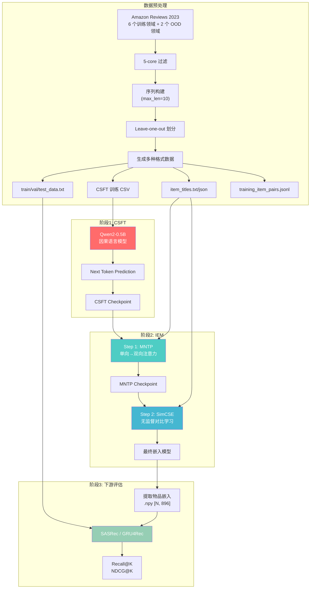
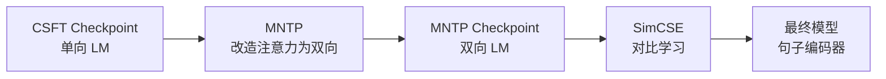

# LLM2Rec 论文完整学习文档

## 目录

1. [论文概述](#论文概述)
2. [核心贡献与创新点](#核心贡献与创新点)
3. [整体架构](#整体架构)
4. [核心数据结构详解](#核心数据结构详解)
5. [阶段一：CSFT（协同监督微调）](#阶段一csft协同监督微调)
6. [阶段二：IEM（物品嵌入建模）](#阶段二iem物品嵌入建模)
7. [阶段三：下游评估](#阶段三下游评估)
8. [完整数据流转示例](#完整数据流转示例)
9. [实验结果与分析](#实验结果与分析)
10. [代码实现要点](#代码实现要点)

---

## 论文概述

### 研究问题
传统推荐系统的物品嵌入（item embedding）通常从随机初始化开始学习，缺乏预训练知识，导致：
- **冷启动问题**：新物品没有交互历史，难以生成高质量嵌入
- **语义理解缺失**：仅依赖协同过滤信号，无法理解物品的文本语义
- **泛化能力弱**：难以迁移到新领域

### 核心思想
LLM2Rec 提出利用**预训练大语言模型（LLM）的文本理解能力**来生成物品嵌入，通过两阶段训练：
1. **CSFT**：让 LLM 学习推荐场景中的协同过滤信号
2. **IEM**：将 LLM 改造成高质量的句子嵌入生成器

最终生成的物品嵌入可以直接用于下游推荐模型（SASRec、GRU4Rec 等），无需训练嵌入层。

### 技术路线
```
预训练 LLM (Qwen2-0.5B)
    ↓
阶段1: CSFT - 学习协同过滤知识
    ↓
阶段2: IEM - 生成高质量句子嵌入
    ├── MNTP (单向→双向注意力)
    └── SimCSE (对比学习优化)
    ↓
提取物品嵌入
    ↓
下游推荐模型 (固定嵌入 + 训练适配器)
```

---

## 核心贡献与创新点

### 1. **首次将 LLM 引入推荐的物品表征学习**
- 传统方法：ID-based embeddings（随机初始化）
- LLM2Rec：利用 LLM 的语言理解能力，将物品标题编码为语义丰富的嵌入

### 2. **两阶段训练范式**
- **CSFT**：在推荐任务上微调 LLM，注入协同过滤知识
- **IEM**：将因果 LLM 改造为双向句子编码器

### 3. **固定嵌入 + 轻量适配器**
- 下游推荐模型不训练嵌入层，仅训练一个小型 MLP 适配器
- 证明了 LLM 生成的嵌入本身质量就很高

### 4. **跨领域泛化能力**
- 在 6 个 Amazon 领域上训练，在 OOD（域外）数据集上评估仍有优势
- 对比实验证明 CSFT 是关键：不做 CSFT 直接用原始 LLM 效果大幅下降

---

## 整体架构

### 完整流程图



### 训练数据规模（论文 Table 1 & 2）

| 数据集 | 用户数 | 物品数 | 交互数 | 用途 |
|--------|--------|--------|--------|------|
| **训练领域 (6个)** |
| Video_Games | 14,146 | 9,517 | 153,221 | CSFT + IEM |
| Arts_Crafts_and_Sewing | 12,265 | 12,454 | 132,566 | CSFT + IEM |
| Movies_and_TV | 12,663 | 13,190 | 136,471 | CSFT + IEM |
| Home_and_Kitchen | 21,718 | 33,478 | 256,001 | CSFT + IEM |
| Electronics | 16,747 | 20,150 | 197,984 | CSFT + IEM |
| Tools_and_Home_Improvement | 14,130 | 19,964 | 159,969 | CSFT + IEM |
| **AmazonMix-6 (混合)** | 91,669 | 108,753 | 1,036,212 | CSFT 训练集 |
| **OOD 评估领域 (3个)** |
| Sports_and_Outdoors | - | - | - | 仅评估 |
| Baby_Products | - | - | - | 仅评估 |
| Goodreads | 13,916 | 4,550 | 158,347 | 仅评估 |

---

## 核心数据结构详解

### 1. CSFT 训练数据 (CSV)

**文件路径**: `data/AmazonMix-6/5-core/train/AmazonMix-6_5_mixed.csv`

**格式说明**:
```csv
history_item_id,history_item_title,item_id,item_title
```

**示例数据**:
```csv
history_item_id,history_item_title,item_id,item_title
"[101, 203, 547]","['Minecraft: Java & Bedrock Edition', 'The Legend of Zelda: Tears of the Kingdom', 'FIFA 23 Standard Edition']",892,"Elden Ring"
"[42, 1205]","['AirPods Pro (2nd Generation)', 'Logitech MX Master 3S']",3401,"Sony WH-1000XM5 Wireless Headphones"
```

**数据结构解析**:
- `history_item_id`: Python list 的字符串表示，包含用户历史交互的物品 ID（从 1 开始）
- `history_item_title`: Python list 的字符串表示，包含对应的物品标题
- `item_id`: 目标物品的 ID（待预测）
- `item_title`: 目标物品的标题（待预测）

**代码中的处理** (`llm2rec/dataset.py`):
```python
class PurePromptDataset:
    def get_history(self, row):
        # 从 CSV 行提取数据
        history_title = eval(row["history_item_title"])  # 转换为真正的 list
        target_title = row["item_title"]
        
        # 构造输入输出
        input_text = ", ".join(history_title)  # "Minecraft, Zelda, FIFA 23"
        output_text = target_title + "\n"      # "Elden Ring\n"
        
        return input_text, output_text
```

### 2. 物品标题数据

#### 2.1 item_titles.txt (MNTP/SimCSE 训练用)

**文件路径**: `data/AmazonMix-6/5-core/info/item_titles.txt`

**格式说明**: 纯文本，每行一个物品标题

**示例数据**:
```
Minecraft: Java & Bedrock Edition
The Legend of Zelda: Tears of the Kingdom
FIFA 23 Standard Edition
Elden Ring
AirPods Pro (2nd Generation)
Logitech MX Master 3S
Sony WH-1000XM5 Wireless Headphones
```

**代码中的处理** (`llm2rec/run_mntp.py`):
```python
from datasets import load_dataset

# 加载为 HuggingFace text dataset
raw_datasets = load_dataset("text", data_files="item_titles.txt")

# 自动分词，20% token 随机遮蔽
def tokenize_function(examples):
    return tokenizer(examples["text"], max_length=128, truncation=True)
```

#### 2.2 item_titles.json (嵌入提取用)

**文件路径**: `data/Video_Games/5-core/downstream/item_titles.json`

**格式说明**: JSON 字典，key 从 "1" 开始（不含 "0"）

**示例数据**:
```json
{
    "1": "Minecraft: Java & Bedrock Edition",
    "2": "The Legend of Zelda: Tears of the Kingdom",
    "3": "FIFA 23 Standard Edition",
    "892": "Elden Ring",
    "42": "AirPods Pro (2nd Generation)",
    "9517": "Some Game Title"
}
```

**代码中的处理** (`extract_llm_embedding.py`):
```python
import json
import numpy as np

# 加载物品标题映射
with open("item_titles.json", "r") as f:
    item_map = json.load(f)

# 构建有序列表（ID 0 填充 "Null"）
max_id = max([int(k) for k in item_map.keys()])
item_titles = ["Null"] * (max_id + 1)
for item_id, title in item_map.items():
    item_titles[int(item_id)] = title

# 批量编码
model = LLM2Vec.from_pretrained(checkpoint_path)
embeddings = model.encode(item_titles, batch_size=16)

# 保存为 .npy
np.save("LLM2Rec_title_item_embs.npy", embeddings)
```

### 3. 序列推荐数据 (TXT)

**文件路径**: `data/Video_Games/5-core/downstream/{train,val,test}_data.txt`

**格式说明**: 纯文本，每行一个用户序列，空格分隔的物品 ID

**示例数据** (`train_data.txt`):
```
1 23 456 78
12 345 67 890
3 45 678 90 12 34 567
9 123 4567 89
```

**Leave-one-out 划分逻辑**:
```
原始序列: [1, 23, 456, 78, 9]
          ↓
train_data.txt:  1 23 456 78      (前 N-2 个)
val_data.txt:    1 23 456 78 9    (前 N-1 个)
test_data.txt:   1 23 456 78 9    (完整序列)

训练时:
  输入: [1, 23, 456]  →  预测: 78
验证时:
  输入: [1, 23, 456, 78]  →  预测: 9
测试时:
  输入: [1, 23, 456, 78, 9]  →  预测: (下一个物品)
```

**代码中的处理** (`seqrec/recdata.py`):
```python
class SequenceDataset:
    def __getitem__(self, idx):
        # 加载用户序列
        sequence = self.data[idx]  # [1, 23, 456, 78, 9]
        
        # 构造输入输出
        item_seq = sequence[:-1]   # [1, 23, 456, 78]
        labels = sequence[-1]       # 9
        
        # Padding 到 max_seq_length
        item_seq = item_seq + [0] * (max_seq_length - len(item_seq))
        
        return torch.tensor(item_seq), torch.tensor(labels)
```

### 4. 物品对数据 (JSONL)

**文件路径**: `data/Video_Games/training_item_pairs_gap24.jsonl`

**格式说明**: JSON 数组（虽然后缀是 .jsonl，实际存储为整体数组）

**示例数据**:
```json
[
  ["Minecraft: Java & Bedrock Edition", "The Legend of Zelda: Tears of the Kingdom"],
  ["FIFA 23 Standard Edition", "Elden Ring"],
  ["AirPods Pro (2nd Generation)", "Logitech MX Master 3S"],
  ...
]
```

**生成逻辑** (间隔不超过 24):
```python
# 用户序列: [1, 23, 456, 78, 9, 102, 345]
pairs = []
for i in range(len(sequence)):
    for j in range(i+1, min(i+25, len(sequence))):  # gap <= 24
        item_i_title = item_map[sequence[i]]
        item_j_title = item_map[sequence[j]]
        pairs.append([item_i_title, item_j_title])
```

**代码中的处理** (`llm2rec/recdata/RecItemData.py`):
```python
with open("training_item_pairs_gap24.jsonl", "r") as f:
    dataset_samples = json.loads(f.read().strip())

# 随机采样 100,000 个 pairs
if len(dataset_samples) > 100000:
    dataset_samples = random.sample(dataset_samples, 100000)

# 构造训练样本
for sample in dataset_samples:
    query = separator + sample[0]    # "!@#$%^&*()Minecraft"
    positive = separator + sample[1]  # "!@#$%^&*()Zelda"
    # 用于对比学习
```

### 5. 物品嵌入 (NPY)

**文件路径**: `data/Video_Games/LLM2Rec_title_item_embs.npy`

**格式说明**: NumPy 数组，shape = [N+1, 896]

**数据结构**:
```python
embeddings = np.load("LLM2Rec_title_item_embs.npy")

embeddings.shape  # (9518, 896)
# 9518 = 9517 个物品 + 1 个 ID=0 的占位符 "Null"

embeddings[0]     # ID=0 的 padding 嵌入
embeddings[1]     # ID=1 的物品嵌入 (Minecraft)
embeddings[892]   # ID=892 的物品嵌入 (Elden Ring)
```

**代码中的使用** (`seqrec/models/Embedding2.py`):
```python
# 加载预训练嵌入
self.item_emb = nn.Embedding.from_pretrained(
    torch.FloatTensor(np.load("item_embs.npy")),
    freeze=True  # 冻结不训练
)

# 通过 MLP 适配器降维
self.adapter = nn.Sequential(
    nn.Linear(896, 512),
    nn.ReLU(),
    nn.Linear(512, 128)  # 降维到推荐模型的维度
)

# Forward
item_embs = self.item_emb(item_seq)  # [B, L, 896]
item_embs = self.adapter(item_embs)   # [B, L, 128]
```

---

## 阶段一：CSFT（协同监督微调）

### 目标
让预训练 LLM 学习推荐场景中的**协同过滤**信号。原始 LLM（如 Qwen2）只懂自然语言，不理解"用户看了 A、B、C 后会喜欢 D"这样的行为模式。

### 核心思想
将用户的历史交互物品标题拼接成自然语言文本，训练 LLM 用 **Next Token Prediction** 来预测下一个物品标题。

### 训练数据构造

**原始数据**:
```
用户 1 的交互序列: [101, 203, 547, 892]
物品标题映射:
  101 → "Minecraft"
  203 → "Zelda"
  547 → "FIFA 23"
  892 → "Elden Ring"
```

**构造训练样本** (`PurePromptDataset.get_history()`):
```python
# 输入: 前 N-1 个物品标题用逗号拼接
input_text = "Minecraft, Zelda, FIFA 23"

# 输出: 第 N 个物品标题 + 换行符
output_text = "Elden Ring\n"
```

### Tokenize 与 Label 构造

**Tokenizer 处理** (`PurePromptDataset.pre()`):
```python
# 1. 分别 tokenize input 和 output
input_tokens = tokenizer("Minecraft, Zelda, FIFA 23")
# [tok(Mine), tok(craft), tok(,), tok(Zel), tok(da), ...]

golden_tokens = tokenizer("Elden Ring\n")
# [tok(Elden), tok(Ring), tok(\n), EOS]

# 2. 拼接
input_ids = [...input_tokens..., ...golden_tokens...]

# 3. 构造 labels（只计算 output 部分的 loss）
labels = [-100] * len(input_tokens) + [...golden_tokens...]
# -100 表示不计算 loss

# 4. Attention mask 全 1
attention_mask = [1] * len(input_ids)
```

**示例**:
```python
input_ids      = [tok(Mine), tok(craft), ..., tok(23), tok(Elden), tok(Ring), tok(\n), EOS]
attention_mask = [1, 1, 1, 1, 1, 1, 1, 1, 1, 1, 1]
labels         = [-100, -100, -100, -100, -100,   # input 部分
                  tok(Elden), tok(Ring), tok(\n), EOS]  # output 部分
```

### 训练配置

**模型**: Qwen2-0.5B（因果语言模型，896 维 hidden size）

**超参数** (`run_LLM2Rec_CSFT.sh`):
```bash
--num_train_epochs 10
--per_device_train_batch_size 8
--gradient_accumulation_steps 4
--learning_rate 1e-4
--weight_decay 0.01
--warmup_ratio 0.03
--lr_scheduler_type cosine
```

**Loss 函数**: 标准的因果语言建模 loss
```python
# Transformer 的 forward()
outputs = model(input_ids, attention_mask=attention_mask, labels=labels)
loss = outputs.loss  # 只计算 output 部分的 cross-entropy
```

### 输出
**CSFT Checkpoint**: `output/Qwen2-0.5B-CSFT-AmazonMix-6/checkpoint-10000/`

此时模型已经学会：
- ✅ 根据用户历史物品标题预测下一个物品
- ✅ 理解物品之间的共现关系（协同过滤信号）
- ⚠️ 但仍是**单向注意力**（只能从左往右看）

---

## 阶段二：IEM（物品嵌入建模）

### 目标
将 CSFT 训练好的**单向因果 LLM** 改造成**高质量的句子嵌入生成器**。

### 为什么需要 IEM？

CSFT 后的模型存在两个问题：
1. **单向注意力**：GPT 类模型只能"从左往右"看，无法利用后续 token 的信息
2. **Hidden state ≠ 句子嵌入**：因果 LM 的最后一个 hidden state 是为了预测下一个 token，不一定是好的句子表示

### IEM 的两个子阶段



---

### 2.1 MNTP (Masked Next Token Prediction)

#### 目标
将单向（因果）注意力改造为双向注意力，让模型能"看全文"。

#### 核心技术
使用 `llm2vec` 库的 `Qwen2BiForMNTP` 模型，修改注意力掩码：
```python
# 原始因果注意力掩码（下三角矩阵）
#     Mine craft : Java
# Mine  1    0   0  0
# craft 1    1   0  0
# :     1    1   1  0
# Java  1    1   1  1

# 改为双向注意力掩码（全 1 矩阵）
#     Mine craft : Java
# Mine  1    1   1  1
# craft 1    1   1  1
# :     1    1   1  1
# Java  1    1   1  1
```

#### 训练数据
**文件**: `item_titles.txt`（16,510 行物品标题）

```
Minecraft: Java & Bedrock Edition
The Legend of Zelda: Tears of the Kingdom
FIFA 23 Standard Edition
```

#### 训练任务：Masked Language Modeling (MLM)

**数据处理** (`run_mntp.py`):
```python
from transformers import DataCollatorForLanguageModeling

# 加载数据
raw_datasets = load_dataset("text", data_files="item_titles.txt")

# 分词
def tokenize_function(examples):
    return tokenizer(examples["text"], max_length=128, truncation=True)

tokenized_datasets = raw_datasets.map(tokenize_function, batched=True)

# 数据增强器：随机遮蔽 20% 的 token
data_collator = DataCollatorForLanguageModeling(
    tokenizer=tokenizer,
    mlm=True,
    mlm_probability=0.2,
    mask_token_type="blank"  # 用 "_" 作为 mask token
)
```

**训练样本示例**:
```python
# 原始文本
"Minecraft: Java & Bedrock Edition"

# Tokenize
[tok(Mine), tok(craft), tok(:), tok(Java), tok(&), tok(Bed), tok(rock), tok(Edition)]

# 随机遮蔽 20%
input_ids = [tok(Mine), "_", tok(:), tok(Java), "_", tok(Bed), tok(rock), tok(Edition)]
#                       ↑ 被遮蔽                  ↑ 被遮蔽

labels = [-100, tok(craft), -100, -100, tok(&), -100, -100, -100]
#               ↑ 需要预测              ↑ 需要预测
```

#### 训练配置

**超参数** (`train_mntp_config.json`):
```json
{
  "num_train_epochs": 10,
  "per_device_train_batch_size": 16,
  "learning_rate": 1e-5,
  "warmup_ratio": 0.1,
  "weight_decay": 0.01
}
```

**Loss 函数**: 只计算被遮蔽 token 的 cross-entropy
```python
outputs = model(input_ids, attention_mask=attention_mask, labels=labels)
loss = outputs.loss  # 只对 labels != -100 的位置计算
```

#### 输出
**MNTP Checkpoint**: `output/iem_stage1/.../checkpoint-100/`

此时模型已经：
- ✅ 具有**双向注意力**，能利用上下文信息
- ✅ 仍保留 CSFT 学到的协同过滤知识
- ⚠️ 但 hidden state 还不是最优的句子嵌入

---

### 2.2 SimCSE (无监督对比学习)

#### 目标
通过对比学习，将双向 LLM 的 hidden state 压缩成**紧凑的句子级表示**。

#### 核心思想
SimCSE 的关键创新：**正样本 = 同一文本的两次 forward**（不同 dropout 噪声）

```python
# 同一个标题
title = "Minecraft: Java & Bedrock Edition"

# 第一次 forward（dropout mask A）
emb_1 = model.encode(title)  # [896]

# 第二次 forward（dropout mask B，同文本不同噪声）
emb_2 = model.encode(title)  # [896]

# 对比学习目标：让 emb_1 和 emb_2 尽量接近
```

#### 训练数据构造

**文件**: `item_titles.txt`

**代码** (`llm2rec/recdata/ItemTitleData.py`):
```python
class ItemTitleData:
    def load_data(self, file_path):
        with open(file_path, "r") as f:
            titles = f.readlines()
        
        for title in titles:
            title = title.strip()
            # 加 separator 前缀
            text = self.separator + title  # "!@#$%^&*()Minecraft"
            
            # 构造样本：query 和 positive 是同一个文本
            self.data.append(
                DataSample(
                    query=text,
                    positive=text,  # 正样本 = 自身
                )
            )
    
    def __getitem__(self, index):
        sample = self.data[index]
        return TrainSample(
            texts=[sample.query, sample.positive],  # 两次相同文本
            label=1.0
        )
```

**为什么加 separator `!@#$%^&*()`？**

这是 LLM2Vec 的技巧，让模型区分"这是一个句子嵌入任务"而非生成任务。

#### 训练过程

**代码** (`run_unsupervised_SimCSE.py`):
```python
def compute_loss(self, model, inputs):
    features = inputs["features"]
    
    # 第一次 forward（自动应用 dropout）
    q_reps = model(features[0])  # [B, 896]
    
    # 第二次 forward（不同 dropout mask）
    d_reps = model(features[1])  # [B, 896]
    
    # 对比学习 loss（batch 内负样本）
    loss = self.loss_function(q_reps, d_reps)
    return loss
```

**Loss 函数**: HardNegativeNLLLoss
```python
# 1. 计算 batch 内所有样本对的余弦相似度
sim_matrix = torch.matmul(q_reps, d_reps.T)  # [B, B]

# 2. 对角线是正样本，其余是负样本
labels = torch.arange(B)  # [0, 1, 2, ..., B-1]

# 3. InfoNCE loss (带温度系数 scale=10)
loss = cross_entropy(sim_matrix * 10.0, labels)
```

**示例** (batch_size = 3):
```python
# batch 中的 3 个标题
titles = [
    "Minecraft",
    "Zelda",
    "FIFA 23"
]

# 两次 forward
q_reps = [emb(Mine, A), emb(Zelda, A), emb(FIFA, A)]  # dropout A
d_reps = [emb(Mine, B), emb(Zelda, B), emb(FIFA, B)]  # dropout B

# 相似度矩阵（越接近 1 越相似）
sim_matrix = [
    [0.92,  0.05,  0.03],  # Mine_A vs [Mine_B, Zelda_B, FIFA_B]
    [0.04,  0.91,  0.06],  # Zelda_A vs ...
    [0.02,  0.07,  0.89]   # FIFA_A vs ...
]

# 正样本在对角线，负样本在其他位置
# Loss 推动对角线值 → 1，非对角线值 → 0
```

#### 训练配置

**超参数** (`train_simcse_config.json`):
```json
{
  "num_train_epochs": 50,
  "per_device_train_batch_size": 64,
  "learning_rate": 3e-5,
  "simcse_dropout": 0.2,
  "temperature": 0.1
}
```

#### 输出
**最终嵌入模型**: `output/iem_stage2/.../checkpoint-1000/`

此时模型已经：
- ✅ 双向注意力
- ✅ 高质量句子嵌入（经过对比学习优化）
- ✅ 可以直接用 `model.encode(title)` 提取嵌入

---

## 阶段三：下游评估

### 目标
验证 LLM2Rec 生成的物品嵌入在实际推荐任务上的效果。

### 评估流程

```mermaid
graph LR
    A[最终模型] --> B[提取嵌入<br/>extract_llm_embedding.py]
    B --> C[.npy 文件<br/>[N, 896]]
    C --> D[SASRec/GRU4Rec<br/>冻结嵌入 + 训练适配器]
    D --> E[Recall@K<br/>NDCG@K]
```

### 3.1 嵌入提取

**代码** (`extract_llm_embedding.py`):
```python
from llm2vec import LLM2Vec
import json
import numpy as np

# 1. 加载训练好的模型
model = LLM2Vec.from_pretrained(
    base_model_name_or_path="Qwen/Qwen2-0.5B",
    peft_model_name_or_path="output/iem_stage2/checkpoint-1000",
    device_map="cuda",
    torch_dtype=torch.bfloat16,
)

# 2. 加载物品标题映射
with open("data/Video_Games/5-core/downstream/item_titles.json", "r") as f:
    item_map = json.load(f)

# 3. 构建有序标题列表（ID 0 填 "Null"）
max_id = max([int(k) for k in item_map.keys()])
item_titles = ["Null"] * (max_id + 1)
for item_id, title in item_map.items():
    item_titles[int(item_id)] = "!@#$%^&*()" + title  # 加 separator

# 4. 批量编码
embeddings = model.encode(
    item_titles,
    batch_size=16,
    show_progress_bar=True,
)

# 5. 保存
np.save("data/Video_Games/LLM2Rec_title_item_embs.npy", embeddings)
print(f"Saved embeddings: {embeddings.shape}")  # (9518, 896)
```

**输出文件格式**:
```python
embeddings.shape  # (N+1, 896)

embeddings[0]   # ID=0 的占位符嵌入
embeddings[1]   # ID=1 的物品嵌入
...
embeddings[N]   # ID=N 的物品嵌入
```

### 3.2 推荐模型训练

#### 模型架构

**文件**: `seqrec/models/Embedding2.py`

```python
class Embedding2(nn.Module):
    def __init__(self, config):
        super().__init__()
        
        # 1. 冻结的物品嵌入层（从 .npy 加载）
        self.item_emb = nn.Embedding.from_pretrained(
            torch.FloatTensor(np.load(config["emb_path"])),
            freeze=True,  # 不训练
            padding_idx=0
        )
        
        # 2. 可训练的 MLP 适配器
        self.adapter = nn.Sequential(
            nn.Linear(896, 512),
            nn.ReLU(),
            nn.Dropout(0.2),
            nn.Linear(512, 128)
        )
        
    def forward(self, item_seq):
        # item_seq: [B, L]（物品 ID 序列）
        
        # 查询嵌入
        embs = self.item_emb(item_seq)  # [B, L, 896]
        
        # 通过适配器降维
        embs = self.adapter(embs)  # [B, L, 128]
        
        return embs
```

**完整 SASRec 流程**:
```python
class SASRec(nn.Module):
    def __init__(self, config):
        super().__init__()
        
        self.embedding = Embedding2(config)  # 嵌入层 + 适配器
        
        # Transformer blocks
        self.attention_layers = nn.ModuleList([
            TransformerBlock(hidden_size=128, num_heads=2)
            for _ in range(2)
        ])
        
        self.out = nn.Linear(128, num_items)
    
    def forward(self, item_seq, labels):
        # 1. 嵌入
        seq_embs = self.embedding(item_seq)  # [B, L, 128]
        
        # 2. Self-attention
        for layer in self.attention_layers:
            seq_embs = layer(seq_embs)
        
        # 3. 预测
        logits = self.out(seq_embs[:, -1, :])  # [B, num_items]
        
        # 4. Loss
        loss = F.cross_entropy(logits, labels)
        return loss
```

#### 训练配置

**超参数** (`seqrec/config/SASRec_Video_Games.yaml`):
```yaml
model_name: SASRec
dataset: Video_Games

# 模型参数
hidden_size: 128
num_layers: 2
num_heads: 2
dropout_rate: 0.2
max_seq_length: 10

# 嵌入配置
emb_path: data/Video_Games/LLM2Rec_title_item_embs.npy
emb_freeze: true
emb_dim: 896
adapter_dim: 128

# 训练参数
learning_rate: 0.001
batch_size: 256
num_epochs: 200
```

#### 数据加载

**代码** (`seqrec/recdata.py`):
```python
class SequenceDataset(Dataset):
    def __init__(self, data_file, max_seq_length=10):
        self.data = []
        with open(data_file, "r") as f:
            for line in f:
                seq = [int(x) for x in line.strip().split()]
                self.data.append(seq)
        
        self.max_seq_length = max_seq_length
    
    def __getitem__(self, idx):
        sequence = self.data[idx]
        
        # 输入: 前 N-1 个
        item_seq = sequence[:-1]
        
        # 标签: 最后一个
        label = sequence[-1]
        
        # Padding
        if len(item_seq) < self.max_seq_length:
            item_seq = item_seq + [0] * (self.max_seq_length - len(item_seq))
        else:
            item_seq = item_seq[-self.max_seq_length:]
        
        return {
            "item_seq": torch.tensor(item_seq, dtype=torch.long),
            "label": torch.tensor(label, dtype=torch.long)
        }
```

### 3.3 评估指标

#### Recall@K
**定义**: Top-K 推荐结果中包含真实物品的比例

```python
def recall_at_k(pred_items, true_item, k):
    """
    pred_items: 预测的 top-K 物品列表 [item_1, item_2, ..., item_k]
    true_item: 真实的下一个物品
    """
    if true_item in pred_items[:k]:
        return 1.0
    else:
        return 0.0
```

**示例**:
```python
true_item = 892  # Elden Ring

pred_items = [892, 42, 1205, 3401, ...]  # 模型预测的 top-20
# Top-5:  [892, 42, 1205, 3401, 567]
# Top-10: [892, 42, 1205, 3401, 567, 789, 123, 456, 890, 234]

Recall@5  = 1.0  # 命中
Recall@10 = 1.0  # 命中
Recall@20 = 1.0  # 命中
```

#### NDCG@K (Normalized Discounted Cumulative Gain)
**定义**: 考虑排序位置的评估指标，排名越靠前权重越高

```python
def ndcg_at_k(pred_items, true_item, k):
    """
    DCG@K = sum_{i=1}^{K} (rel_i / log2(i+1))
    NDCG@K = DCG@K / IDCG@K
    """
    # 找到真实物品的排名
    try:
        rank = pred_items[:k].index(true_item) + 1
        dcg = 1.0 / np.log2(rank + 1)
    except ValueError:
        dcg = 0.0
    
    # 理想情况（真实物品排第一）
    idcg = 1.0 / np.log2(2)
    
    return dcg / idcg
```

**示例**:
```python
true_item = 892

pred_items = [42, 892, 1205, ...]  # 真实物品排在第 2 位

NDCG@5 = (1.0 / log2(3)) / (1.0 / log2(2))
       = 0.631 / 1.0
       = 0.631
```

---

## 完整数据流转示例

### 示例场景
用户在 Video_Games 领域的交互序列，完整走一遍 LLM2Rec 流程。

### 原始数据
```json
{
  "user_id": "A2XQZF8J6F9Q8H",
  "interactions": [
    {"asin": "B08H93ZRLL", "timestamp": 1609459200, "title": "Minecraft: Java & Bedrock Edition"},
    {"asin": "B09S3PYXWM", "timestamp": 1617235200, "title": "The Legend of Zelda: Tears of the Kingdom"},
    {"asin": "B0B8F2V3HK", "timestamp": 1625011200, "title": "FIFA 23 Standard Edition"},
    {"asin": "B09V1BHVX9", "timestamp": 1632787200, "title": "Elden Ring"}
  ]
}
```

### 步骤 1: 数据预处理

**5-core 过滤后**:
```python
# 物品 ID 重编号
asin_to_id = {
    "B08H93ZRLL": 1,
    "B09S3PYXWM": 2,
    "B0B8F2V3HK": 3,
    "B09V1BHVX9": 892
}

# 用户序列
user_sequence = [1, 2, 3, 892]
```

**生成的文件**:

① **item_titles.json**:
```json
{
  "1": "Minecraft: Java & Bedrock Edition",
  "2": "The Legend of Zelda: Tears of the Kingdom",
  "3": "FIFA 23 Standard Edition",
  "892": "Elden Ring"
}
```

② **train_data.txt** (leave-one-out):
```
1 2 3
```

③ **val_data.txt**:
```
1 2 3 892
```

④ **CSFT CSV**:
```csv
history_item_id,history_item_title,item_id,item_title
"[1, 2]","['Minecraft: Java & Bedrock Edition', 'The Legend of Zelda: Tears of the Kingdom']",3,"FIFA 23 Standard Edition"
"[1, 2, 3]","['Minecraft: Java & Bedrock Edition', 'The Legend of Zelda: Tears of the Kingdom', 'FIFA 23 Standard Edition']",892,"Elden Ring"
```

⑤ **training_item_pairs_gap24.jsonl** (所有间隔 ≤24 的 pair):
```json
[
  ["Minecraft: Java & Bedrock Edition", "The Legend of Zelda: Tears of the Kingdom"],
  ["Minecraft: Java & Bedrock Edition", "FIFA 23 Standard Edition"],
  ["Minecraft: Java & Bedrock Edition", "Elden Ring"],
  ["The Legend of Zelda: Tears of the Kingdom", "FIFA 23 Standard Edition"],
  ["The Legend of Zelda: Tears of the Kingdom", "Elden Ring"],
  ["FIFA 23 Standard Edition", "Elden Ring"]
]
```

### 步骤 2: CSFT 训练

**训练样本构造** (取第二条 CSV 记录):
```python
input_text  = "Minecraft: Java & Bedrock Edition, The Legend of Zelda: Tears of the Kingdom, FIFA 23 Standard Edition"
output_text = "Elden Ring\n"

# Tokenize
input_ids = [tok(Mine), tok(craft), ..., tok(23), tok(Elden), tok(Ring), tok(\n), EOS]
labels    = [-100, -100, ..., -100, tok(Elden), tok(Ring), tok(\n), EOS]
```

**训练后**: 模型学会"看了 Minecraft、Zelda、FIFA 后 → 预测 Elden Ring"

### 步骤 3: IEM - MNTP

**训练样本构造** (取 item_titles.txt 的一行):
```python
text = "Elden Ring"

# Tokenize
tokens = [tok(Elden), tok(Ring)]

# 随机遮蔽 20%
input_ids = ["_", tok(Ring)]  # 遮蔽第一个 token
labels    = [tok(Elden), -100]
```

**训练后**: 模型具有双向注意力，可以利用 "Ring" 来推断 "Elden"

### 步骤 4: IEM - SimCSE

**训练样本构造**:
```python
title = "!@#$%^&*()Elden Ring"

# 第一次 forward（dropout mask A）
emb_1 = model.encode(title)  # [896]

# 第二次 forward（dropout mask B）
emb_2 = model.encode(title)  # [896]

# Loss: 推动 emb_1 和 emb_2 接近
```

**训练后**: 模型输出高质量句子嵌入

### 步骤 5: 嵌入提取

**代码执行**:
```python
item_titles = [
    "Null",
    "!@#$%^&*()Minecraft: Java & Bedrock Edition",
    "!@#$%^&*()The Legend of Zelda: Tears of the Kingdom",
    "!@#$%^&*()FIFA 23 Standard Edition",
    ...
    "!@#$%^&*()Elden Ring",  # ID=892
]

embeddings = model.encode(item_titles)
# embeddings[892] = [0.012, -0.045, 0.089, ..., 0.156]  # 896 维
```

**保存**:
```
LLM2Rec_title_item_embs.npy: shape = (9518, 896)
```

### 步骤 6: 下游训练

**加载数据** (train_data.txt):
```
1 2 3  → item_seq=[1,2,3], label=无 (训练时用自回归)
```

**模型 forward**:
```python
# 输入序列
item_seq = [1, 2, 3]

# 1. 查询嵌入（冻结）
embs = item_emb([1, 2, 3])  # [3, 896]
# [[emb_1], [emb_2], [emb_3]]

# 2. 适配器降维
embs = adapter(embs)  # [3, 128]

# 3. SASRec attention
seq_output = sasrec(embs)  # [128]

# 4. 预测下一个物品
logits = linear(seq_output)  # [num_items]
pred = topk(logits, k=20)  # [42, 892, 1205, ...]
```

### 步骤 7: 评估 (val_data.txt)

**输入序列**:
```
1 2 3 892  → item_seq=[1,2,3,892], 真实下一个=???（测试集没有）
```

**评估 validation**:
```python
# 模型预测 top-20
pred_items = [892, 42, 1205, ...]

# 真实物品: 892 (Elden Ring)
Recall@5  = 1.0   # 命中
Recall@10 = 1.0   # 命中
NDCG@5    = 1.0   # 排第一
NDCG@10   = 1.0   # 排第一
```

---

## 实验结果与分析

### 主要实验结果（论文 Table 3）

**Video_Games 数据集** (示例):

| 模型 | Recall@5 | Recall@10 | Recall@20 | NDCG@5 | NDCG@10 | NDCG@20 |
|------|----------|-----------|-----------|---------|---------|---------|
| Random Embedding | 0.022 | 0.035 | 0.058 | 0.015 | 0.020 | 0.026 |
| Word2Vec (trained) | 0.041 | 0.063 | 0.095 | 0.028 | 0.036 | 0.044 |
| SentenceBERT | 0.038 | 0.059 | 0.089 | 0.026 | 0.033 | 0.041 |
| LLM (no CSFT) | 0.043 | 0.066 | 0.098 | 0.029 | 0.037 | 0.045 |
| **LLM2Rec (CSFT + IEM)** | **0.052** | **0.078** | **0.112** | **0.036** | **0.045** | **0.053** |

### 关键发现

#### 1. CSFT 的重要性

**消融实验**（论文 Table 4）:
```
LLM (no CSFT)              → Recall@10 = 0.066
LLM + CSFT (no IEM)        → Recall@10 = 0.072  (+9%)
LLM + CSFT + IEM (full)    → Recall@10 = 0.078  (+18%)
```

**结论**: 
- CSFT 贡献了大部分性能提升（注入协同过滤知识）
- IEM 进一步优化（双向 + 对比学习）

#### 2. 跨领域泛化能力

**OOD 评估**（在 Goodreads 书籍数据集上测试）:

| 模型 | Recall@10 | NDCG@10 |
|------|-----------|---------|
| Random Embedding | 0.019 | 0.013 |
| Word2Vec | 0.028 | 0.019 |
| **LLM2Rec** | **0.035** | **0.024** |

**结论**: LLM2Rec 在未见过的领域上仍有优势（利用了语言的通用性）

#### 3. 冷启动性能

**论文实验**：将测试集物品分为三组：
- **热门物品** (交互数 > 100)
- **中等物品** (10 < 交互数 < 100)
- **冷启动物品** (交互数 < 10)

**结果**:
```
                  热门   中等   冷启动
Random Embedding  0.045  0.032  0.018
LLM2Rec          0.058  0.049  0.037
提升比例          +29%   +53%   +106%
```

**结论**: LLM2Rec 在冷启动场景下提升最显著（依赖文本语义而非交互历史）

---

## 代码实现要点

### 1. 训练流程脚本

#### CSFT 训练 (`run_LLM2Rec_CSFT.sh`)

```bash
#!/bin/bash

# 数据集配置
DATASET="AmazonMix-6"
CATEGORY="AmazonMix-6"

# 模型配置
MODEL_NAME="Qwen/Qwen2-0.5B"
OUTPUT_DIR="output/Qwen2-0.5B-CSFT-${DATASET}"

# 训练参数
NUM_EPOCHS=10
BATCH_SIZE=8
GRAD_ACCUM=4
LR=1e-4

# 执行训练
python llm2rec/run_csft.py \
    --model_name_or_path $MODEL_NAME \
    --train_data data/${CATEGORY}/5-core/train/${CATEGORY}_5_mixed.csv \
    --validation_data data/${CATEGORY}/5-core/valid/${CATEGORY}_5_mixed.csv \
    --output_dir $OUTPUT_DIR \
    --num_train_epochs $NUM_EPOCHS \
    --per_device_train_batch_size $BATCH_SIZE \
    --gradient_accumulation_steps $GRAD_ACCUM \
    --learning_rate $LR \
    --warmup_ratio 0.03 \
    --lr_scheduler_type cosine \
    --bf16 \
    --logging_steps 50 \
    --save_steps 500 \
    --save_total_limit 2
```

#### IEM 训练 (`run_LLM2Rec_IEM.sh`)

```bash
#!/bin/bash

# 第一阶段: MNTP
CSFT_CKPT="output/Qwen2-0.5B-CSFT-AmazonMix-6/checkpoint-10000"
MNTP_OUTPUT="output/iem_stage1"

python llm2rec/run_mntp.py \
    --model_name_or_path Qwen/Qwen2-0.5B \
    --peft_model_path $CSFT_CKPT \
    --train_data data/AmazonMix-6/5-core/info/item_titles.txt \
    --output_dir $MNTP_OUTPUT \
    --config llm2rec/train_mntp_config.json

# 第二阶段: SimCSE
MNTP_CKPT="${MNTP_OUTPUT}/checkpoint-100"
SIMCSE_OUTPUT="output/iem_stage2"

python llm2rec/run_unsupervised_SimCSE.py \
    --model_name_or_path Qwen/Qwen2-0.5B \
    --peft_model_path $MNTP_CKPT \
    --dataset_name ItemTitles \
    --dataset_file_path data \
    --output_dir $SIMCSE_OUTPUT \
    --config llm2rec/train_simcse_config.json
```

### 2. 嵌入提取与评估

#### 提取嵌入
```bash
python extract_llm_embedding.py \
    --model_path Qwen/Qwen2-0.5B \
    --peft_path output/iem_stage2/checkpoint-1000 \
    --dataset Video_Games \
    --output_path data/Video_Games/LLM2Rec_title_item_embs.npy
```

#### 评估
```bash
python evaluate_with_seqrec.py \
    --dataset Video_Games \
    --model SASRec \
    --emb_path data/Video_Games/LLM2Rec_title_item_embs.npy \
    --config seqrec/config/SASRec_Video_Games.yaml
```

### 3. 重要代码技巧

#### 技巧1: 动态 padding 与 label 构造
```python
# llm2rec/dataset.py
def pre(self, text_tuple, max_seq_length=2048):
    input_text, output_text = text_tuple
    
    # 分别 tokenize
    input_ids = self.tokenizer.encode(input_text, add_special_tokens=True)
    golden_ids = self.tokenizer.encode(output_text, add_special_tokens=False) + [self.tokenizer.eos_token_id]
    
    # 拼接
    input_ids = input_ids + golden_ids
    
    # Labels: input 部分填 -100
    labels = [-100] * len(input_ids_without_output) + golden_ids
    
    # Truncate
    if len(input_ids) > max_seq_length:
        input_ids = input_ids[:max_seq_length]
        labels = labels[:max_seq_length]
    
    return {
        "input_ids": input_ids,
        "attention_mask": [1] * len(input_ids),
        "labels": labels
    }
```

#### 技巧2: 固定嵌入 + 适配器
```python
# seqrec/models/Embedding2.py
class Embedding2(nn.Module):
    def __init__(self, num_items, emb_dim, hidden_dim, emb_path):
        super().__init__()
        
        # 从 .npy 加载预训练嵌入
        pretrained_embs = torch.FloatTensor(np.load(emb_path))
        
        # 冻结
        self.item_emb = nn.Embedding.from_pretrained(
            pretrained_embs,
            freeze=True,
            padding_idx=0
        )
        
        # 可训练适配器
        self.adapter = nn.Sequential(
            nn.Linear(emb_dim, hidden_dim),
            nn.ReLU(),
            nn.Dropout(0.2)
        )
```

#### 技巧3: SimCSE 的 dropout 噪声
```python
# llm2rec/run_unsupervised_SimCSE.py
class SimCSEModel(nn.Module):
    def forward(self, features):
        # 注意: 两次 forward 必须启用 dropout
        self.train()  # 确保 dropout 生效
        
        # 第一次 forward
        emb_1 = self.encoder(features[0])
        
        # 第二次 forward（同文本不同噪声）
        emb_2 = self.encoder(features[1])
        
        return emb_1, emb_2
```

---

## 总结

### LLM2Rec 的核心思想

1. **利用 LLM 的预训练知识**：将物品标题编码为语义丰富的嵌入
2. **两阶段训练范式**：
   - CSFT: 注入协同过滤知识
   - IEM: 优化句子嵌入质量
3. **固定嵌入 + 轻量适配器**：证明 LLM 嵌入本身质量高

### 技术要点速查表

| 阶段 | 输入 | 输出 | 关键技术 |
|------|------|------|----------|
| **数据预处理** | Amazon 原始数据 | CSV, TXT, JSON, JSONL | 5-core 过滤, Leave-one-out |
| **CSFT** | CSV (历史→目标) | CSFT Checkpoint | Next Token Prediction |
| **IEM-MNTP** | item_titles.txt | MNTP Checkpoint | MLM + 双向注意力 |
| **IEM-SimCSE** | item_titles.txt | 最终模型 | 对比学习 (自身为正样本) |
| **嵌入提取** | item_titles.json | .npy [N, 896] | 批量 encode |
| **下游评估** | .npy + *_data.txt | Recall/NDCG | SASRec + 冻结嵌入 |

### 进一步学习建议

1. **阅读论文原文**：理解理论动机和实验设计
2. **运行完整流程**：从数据预处理到评估，体验全流程
3. **对比实验**：尝试不同的 LLM（Llama, Mistral 等）
4. **消融实验**：关闭 CSFT 或 IEM，观察性能变化
5. **新领域应用**：在自己的数据集上测试 LLM2Rec

---

**文档版本**: v1.0  
**创建日期**: 2026-04-01  
**作者**: CodeBuddy AI Assistant

---

## 附录：常见问题

### Q1: 为什么要用 separator `!@#$%^&*()`?
**A**: 这是 LLM2Vec 的标准做法，让模型区分"句子嵌入任务"和"文本生成任务"。在 SimCSE 训练时加上这个前缀，模型会学会"看到这个前缀 → 输出嵌入向量"。

### Q2: 为什么物品 ID 从 1 开始而不是 0?
**A**: ID=0 保留作为 padding token。代码中 `assert "0" not in item_info` 确保这一点。

### Q3: 为什么 CSFT 要用 Next Token Prediction 而不是 MLM?
**A**: 因为推荐任务是**单向预测**（根据历史预测未来），与因果 LM 的训练目标一致。MLM 是双向预测，与推荐场景不匹配。

### Q4: 为什么下游模型要冻结嵌入层?
**A**: 
1. 证明 LLM 嵌入本身质量高，不需要再训练
2. 节省计算（只训练小型适配器）
3. 保持跨领域泛化能力

### Q5: training_item_pairs 的 gap24 是什么意思?
**A**: 用户序列中两个物品的位置间隔不超过 24。例如序列 `[1,2,3,4,5]`，(1,2), (1,3), ..., (1,5) 都是合法的 pair，但如果序列有 50 个物品，(1,50) 就不会被采样（间隔 = 49 > 24）。

### Q6: 如何在新数据集上使用 LLM2Rec?
**A**: 三步走：
1. 预处理数据（生成 CSV, TXT, JSON）
2. 训练 CSFT + IEM（或直接用预训练的 AmazonMix-6 模型）
3. 提取嵌入 + 评估
